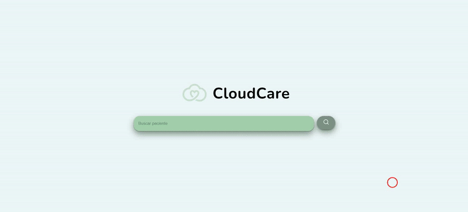

<a id="top"></a>
#  CloudCare

Proyecto realizado para la dathaton de 2025 organizada por Dedalus en Málaga junto a diferentes [organizadores](#entidades-colaboradoras-de-la-dathaton) más.




## Índice:
- [Descripción del reto a abordar](#descripción-del-reto-a-abordar)
- [Descripción de nuestra solución](#descripción-de-nuestra-solución)
- [Como Compilar el proyecto](#como-compilar-el-proyecto)
- [Estructura de GitHub](#estructura-de-github)
- [Autores](#autores)
- [Tecnologias utilizadas](#tecnologias-utilizadas)
- [Entidades colaboradoras de la dathaton](#entidades-colaboradoras-de-la-dathaton)


## Descripción del reto a abordar
### Reto 1:

Este proyecto tiene como objetivo desarrollar un asistente basado en inteligencia artificial que automatice la generación de resúmenes evolutivos para pacientes hospitalizados al momento del alta médica. El asistente está diseñado para reducir la carga administrativa del personal sanitario y mejorar la calidad y estandarización de los informes clínicos.

## Descripción de nuestra solución
Nuestro equipo decidión hacer una aplicación en la que tú como médico puedes buscar a un paciente y luego seleccionarlo puedes ver un historial de datos como por ejemplo la primera analítica de cuando ingresó, un historial de notas que ha hecho el médico, la razon por la que entró el paciente...

Tras esto, puedes seleccionar en el apartado lateral los datos de las anlíticas del paciente, las cuales están organizadas por fechas y horas. Esto te mostrará un panel con gráficos sobre los parámetros de las analíticas y si están entre los valores normales o no.

Como último tenemos y lo más importante el médico tiene la posibilidad de preguntarle a un ChatBot datos sobre el paciente, así como pedirle un resumen evolutivo del paciente, o incluso un gráfico con sus datos.

<p style="text-align: left;">
    <a href="#top">⬆️ volver arriba</a>
</p>

## Como compilar el proyecto


## Estructura de GitHub
Por ahora dispondremos las carpetas del proyecto tal que así:

```markdawn
CloudCare/  
├── backend/  
│   ├── api/                  # API Gateway/Lambda  
│   ├── data_processing/      # Scripts de ETL  
│   └── prompts/              # Plantillas de prompts médicos  
├── frontend/  
│   ├── src/app/  
│   │   ├── chat/             # Componente de chat  
│   │   └── visualizations/   # Gráficos y tablas  
├── ml/  
│   ├── data/                 # Datos sintéticos y copia de seguridad sql
├── docs/  
│   ├── architecture.md       # Diagrama de arquitectura  
│   └── presentation/         # Material para la presentación  
└── .github/  
    └── workflows/            # CI/CD para despliegue AWS  
````

### Flujo de Ramas:
Estas ramas son las que me ha recomendado ChatGpt

1. `main` → Solo código estable.
2. `dev` → Integración diaria.
3. Ramas específicas:
    - `feat/medical-rag`
    - `feat/context-management`
    - `feat/visualizations`

## Autores

| [<br><sub>Fernado Osuna Granados</sub>](https://github.com/fog-3) |  [<br><sub>Pablo Gámez Guerrero</sub>](https://github.com/Zemag17) |  [<br><sub>Hugo Macías Jiménez</sub>](https://github.com/hugooomaciias) |  [<br><sub>Jesús Alcázar Pérez</sub>](https://github.com/jesusAlcPer25) |
| :---: | :---: | :---: | :---: |


## Tecnologias utilizadas

 &nbsp;
 &nbsp;
 &nbsp;
 &nbsp;
 &nbsp;
 &nbsp;
 &nbsp;
 &nbsp;
 &nbsp;


<p align="center">

</p>

## Entidades colaboradoras de la dathaton

<div align="center">
 &nbsp;&nbsp;&nbsp;
 &nbsp;&nbsp;&nbsp; 
</div>
<br><br>

<div align="center">
 &nbsp;&nbsp;&nbsp;&nbsp;&nbsp;&nbsp;

</div>
<br><br>

Más información sobre la dathaton en este link: [Dathaton 2025 Malaga](https://www.dedalushackathon.com/datathon-andalucia).

<p style="text-align: left;">
    <a href="#top">⬆️ volver arriba</a>
</p>
